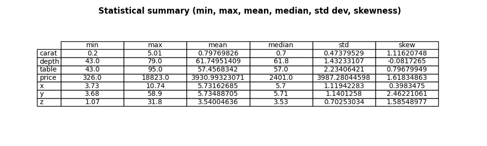
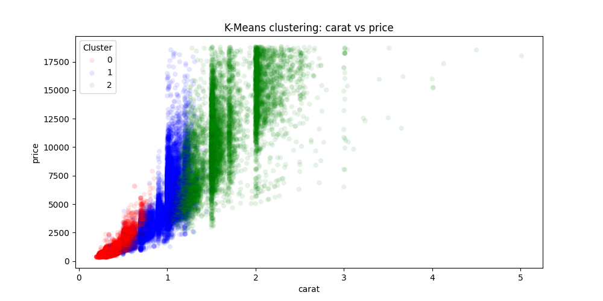
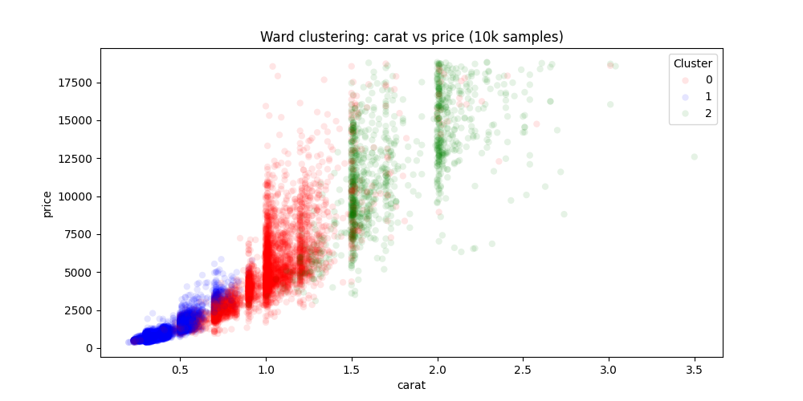
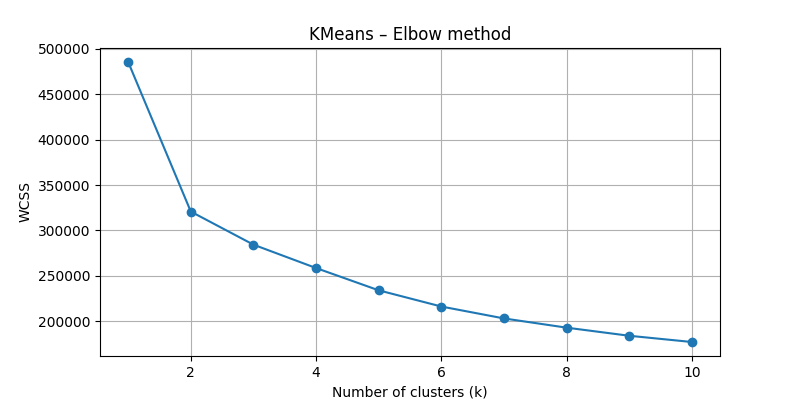
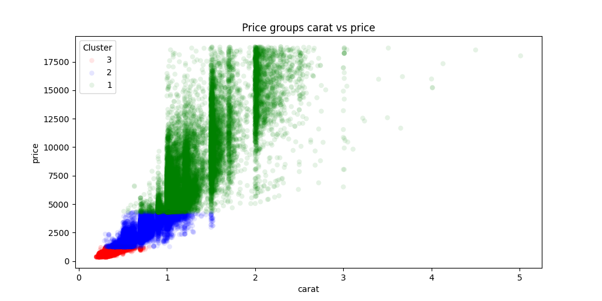

# Diamonds Clustering

Unsupervised clustering analysis of the [ggplot2 diamonds dataset](https://ggplot2.tidyverse.org/reference/diamonds.html) (~53 940 records) using K-Means and Ward's method. The project explores whether clusters formed on physical and quality features of diamonds correspond to natural price segments.

---

## Authors

5-person team project — SGGW, course: Metody Analizy Danych (2025).

| Name | GitHub |
|------|--------|
| Jakub Rosa | [PogchampMuffin3](https://github.com/PogchampMuffin3)|
| Artur Nejmanowski | [arturn0](https://github.com/arturn0)|
| Hubert Murawski | [ulan9007](https://github.com/ulan9007)|
| Dawid Stasiak | [Dawidks294](https://github.com/Dawidks294)|
| Wojciech Seńko | [wojsen](https://github.com/wojsen)|

> The project was developed collaboratively outside of a version control system.

---

## Dataset

The dataset contains 53 940 diamonds described by 10 features. 20 records with x/y/z = 0 (physically invalid) were removed before analysis, leaving 53 920 records.

| Feature | Description |
|---------|-------------|
| `carat` | Weight of the diamond |
| `cut` | Cut quality (Fair -> Ideal) |
| `color` | Diamond colour (D-J scale) |
| `clarity` | Clarity grade (I1 -> IF) |
| `depth` | Total depth percentage |
| `table` | Width of top facet relative to widest point |
| `price` | Price in USD |
| `x`, `y`, `z` | Physical dimensions (mm) |

Download: [diamonds.csv on Kaggle](https://www.kaggle.com/datasets/shivam2503/diamonds)

---

## Method

1. **Data cleaning** — removal of 20 records with x/y/z = 0 (0.037% of dataset)
2. **Encoding** — ordinal mapping of categorical features (`cut`, `color`, `clarity`) to integers preserving natural order (1 = best)
3. **Standardisation** — StandardScaler (mean = 0, std = 1)
4. **Optimal k selection** — Elbow method (K-Means) and Silhouette Score (both methods); k = 3 selected as a balance between quality and interpretability (k = 2 gave the highest silhouette but was too coarse)
5. **Clustering** — K-Means and Ward's method with k = 3; K-Means uses `random_state=42`, `n_init=10`

---

## Results

Clusters were compared against three price groups based on price quantiles (low / medium / high).

| Method | Price group overlap |
|--------|-------------------|
| K-Means | **69.86%** |
| Ward's method | 37.78% |

> K-Means runs on the full dataset. Ward's method was originally
> run on the full dataset (32 GB RAM required) - results documented in `docs/raport.docx`.
> The repository code runs Ward on a 10 000-record sample for standard hardware compatibility;
> sample results may differ slightly from the report.

K-Means clusters showed sharper boundaries and better correspondence with price segments. The analysis confirmed that `carat` and `cut` have the strongest influence on price — notably, diamonds exceeding 1 carat show a disproportionate price jump regardless of other features.

Generated plots are saved to the `wykresy/` folder:
- Histograms and boxplots for all numeric features
- Pie charts for categorical features
- Statistical summary table (min, max, mean)
- Elbow method chart (K-Means)
- Silhouette Score charts (K-Means and Ward)

## Visualisations

### Exploratory data analysis

*Descriptive statistics for all numeric features.*

### Clustering results (carat vs price)
| K-Means — full dataset | Ward — 10k sample |
|:---:|:---:|
|  |  |
*69.86% overlap with price quantile groups | 37.78% overlap with price quantile groups (on 10k sample).*

---

### Cluster selection

*Elbow method for K-Means — k=3 selected as a balance between WCSS reduction and interpretability.*

---

### Price group ground truth (carat vs price)

*Diamonds grouped into low / medium / high price quantiles - used as reference for evaluating cluster overlap.*

---

## Requirements

```
pandas
matplotlib
scikit-learn
seaborn
```

Install with:

```bash
pip install -r requirements.txt
```

---

## Usage

```bash
python main.py
```

Set `SAVE_PLOTS = False` in `main.py` to display plots interactively instead of saving them to files.


